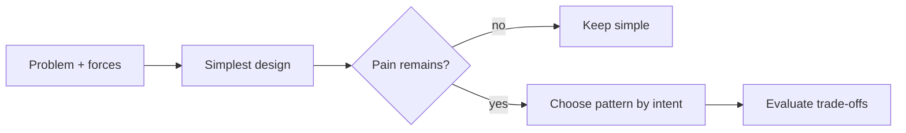

# Design Pattern Foundations

> **Wall Note / A4**
>
> **Pattern = named, reusable design trade-off.** Start from a recurring problem and forces, not from a catalog name. Prefer the simplest design that works.

## Detailed Notes

### What and why
A design pattern is not copy-paste implementation. It is vocabulary for a recurring arrangement of responsibilities under specific forces. Intent and trade-offs matter more than reproducing UML.

### How it works
Identify the changing dimension, stable dimension, ownership/lifecycle, coupling, and failure modes. Try simple refactoring first: extract function/class, composition, interface, data-driven table, standard library, or framework capability.

### When to use it
Use a pattern when a recurring structural problem is visible or a framework explicitly asks for an extension point with that shape.

### When NOT to use it
Do not pattern-match code by appearance, create interfaces for hypothetical futures, or add indirection merely to claim SOLID/pattern use.

### Practical example
A repeated provider switch across controllers is a real smell. First centralize variation; Strategy or Adapter may then be justified depending on whether the problem is policy choice or external-interface translation.

### Trade-offs
Patterns often reduce change coupling while increasing indirection, type count, or runtime composition.

### Failure modes and common mistakes
Pattern fever, cargo-cult UML, confusing framework mechanisms with pattern intent, and choosing a pattern before understanding the domain.

## Senior Questions / Exercises
1. Given a service with two implementations, what evidence would justify adding a pattern?
2. For repeated conditionals, compare data-driven lookup, polymorphism, Strategy, and State.
3. Name a pattern you would remove from an overengineered codebase and explain why.

## Related Topics
- [Pattern selection](./pattern-selection.md)
- [Programming principles](https://github.com/YosrBennagra/programming-principles)
- [Software architecture](https://github.com/YosrBennagra/software-architecture)

[← Repository home](../README.md)
