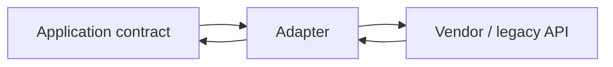

# Adapter

> **Wall Note / A4**
>
> **Intent:** translate one interface into another. **Signal:** a useful component has the wrong interface. **Trade-off:** translation boundary.



## Detailed Notes

### What and why
Adapter preserves an application-facing contract while wrapping an incompatible dependency. It is especially useful at external boundaries because vendor DTOs, error types, naming, authentication mechanics, and version quirks stay outside the core model.

### How it works
Use composition. The adapter implements the interface expected by the application, delegates to the adaptee, and translates:
- request/response models;
- units and value types;
- provider error codes;
- authentication/configuration;
- pagination/cursor conventions;
- timeout/retry-safe semantics where appropriate.

An adapter should translate semantics, not merely rename methods.

### When to use it
Use for legacy APIs, third-party SDKs, provider integrations, protocol/model translation, and Angular services wrapping browser/vendor APIs.

### When NOT to use it
Avoid it if you control both sides and can evolve the interface directly. Do not let the adapter become a service containing pricing, eligibility, workflow, or other core business rules.

### Java / Spring example

```java
public interface PaymentGateway {
    PaymentResult charge(PaymentRequest request);
}

@Component
final class AcmePaymentGatewayAdapter implements PaymentGateway {
    private final AcmePaymentsClient client;

    AcmePaymentGatewayAdapter(AcmePaymentsClient client) {
        this.client = client;
    }

    @Override
    public PaymentResult charge(PaymentRequest request) {
        var response = client.createCharge(new AcmeCharge(
            request.orderId().value(),
            request.amount().minorUnits(),
            request.amount().currency().getCurrencyCode()
        ));

        return switch (response.status()) {
            case "PAID" -> PaymentResult.succeeded(response.id());
            case "DECLINED" -> PaymentResult.declined(response.reason());
            default -> throw new PaymentGatewayUnavailable(response.status());
        };
    }
}
```

The rest of the application does not know Acme DTOs or status strings.

### Angular example

```ts
export interface ClipboardPort {
  writeText(value: string): Promise<void>;
}

@Injectable({ providedIn: 'root' })
export class BrowserClipboardAdapter implements ClipboardPort {
  async writeText(value: string): Promise<void> {
    await navigator.clipboard.writeText(value);
  }
}
```

Tests can replace the port without touching browser globals.

### Trade-offs
Adapter reduces vendor coupling and improves testability. The cost is translation code, duplicated-looking models, and responsibility for preserving semantic differences.

### Failure modes and common mistakes
- Returning vendor DTOs through the application interface.
- Mapping every provider failure to one generic exception.
- Retrying in the adapter without knowing whether the operation is idempotent.
- Hiding provider latency and rate-limit semantics from callers that need them.
- Adding business rules because “the adapter already has the data.”

## Senior Questions / Exercises
1. What belongs in an adapter versus a domain service?
2. How do you prevent a third-party SDK from leaking across a codebase?
3. Compare Adapter and Facade.
4. How should an adapter represent a provider timeout when the remote side may have completed the operation?
5. Design an adapter around two payment providers whose refund semantics differ.

## Related Topics
- [Facade](./facade.md)
- [Strategy](../03-behavioral/strategy.md)
- [System design: resilience](https://github.com/YosrBennagra/system-design)
- [Software architecture](https://github.com/YosrBennagra/software-architecture)
