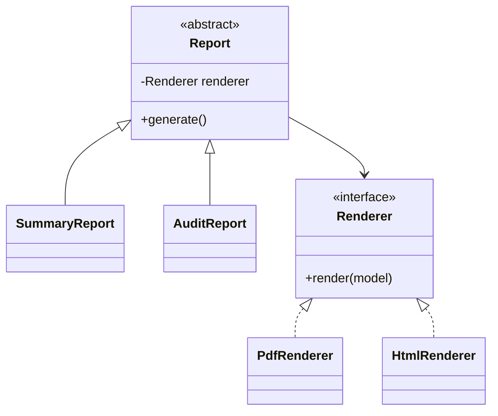

# Bridge

> **Wall Note / A4**
>
> **Intent:** split two independently varying dimensions instead of multiplying subclasses. **Signal:** Cartesian-product hierarchy such as ReportType × Renderer.

## Detailed Notes

Bridge replaces inheritance across two axes with composition.



Without Bridge, two report types × two renderers already create four subclasses; adding dimensions multiplies combinations.

### Java sketch

```java
interface Renderer { byte[] render(ReportModel model); }

abstract class Report {
    protected final Renderer renderer;
    protected Report(Renderer renderer) { this.renderer = renderer; }
    abstract byte[] generate();
}
```

DI can assemble any abstraction/implementation combination.

### Bridge vs Strategy
Both use composition. Strategy usually varies an **algorithm/policy inside one conceptual operation**. Bridge deliberately separates **two long-lived abstraction hierarchies** that evolve independently.

### Bridge vs Adapter
Bridge is designed up front to separate axes. Adapter is usually introduced to make an existing incompatible interface fit.

### Failure modes
- two variation axes do not really exist;
- abstraction leaks implementation-specific methods;
- one side changes only once yet introduces a whole hierarchy;
- Bridge used where a single Strategy interface is enough.

## Senior Questions / Exercises
1. Show the subclass count before/after Bridge for 4 report types × 3 renderers.
2. Identify two real independent variation axes before proposing Bridge.
3. When is Strategy simpler?
4. How would Spring DI assemble Bridge combinations?

## Related Topics
- [Strategy](../03-behavioral/strategy.md)
- [Adapter](./adapter.md)
