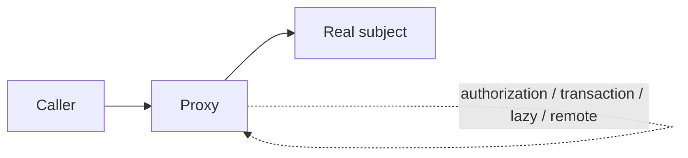
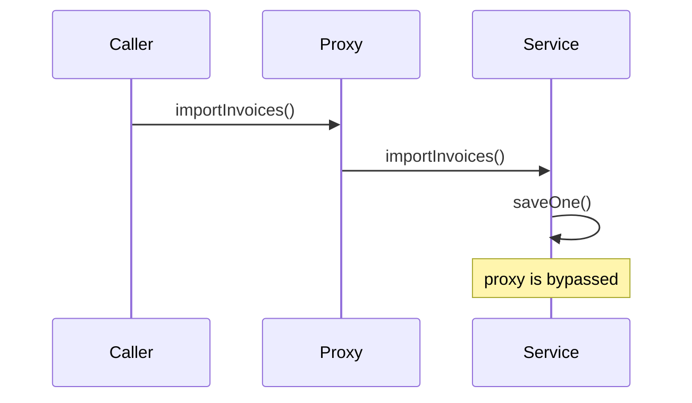

# Proxy

> **Wall Note / A4**
>
> **Intent:** control access to another object while preserving its interface. **Signal:** lazy loading, remote access, authorization, transactions, caching, instrumentation. **Trade-off:** behavior becomes less visible at the call site.



## Detailed Notes

### What and why
Proxy stands in for a real subject and controls access. Virtual, remote, protection, caching, lazy-loading, and framework-generated proxies share structure but differ in intent.

### How it works
The caller invokes the subject interface. The proxy can run logic before/after delegation or even avoid delegation.

Framework proxies often intercept calls dynamically. This means **call path matters**: behavior supplied by a proxy is applied only when execution actually passes through that proxy.

### When to use it
Use for transaction/interception boundaries, lazy resources, authorization gates, remote clients, method security, and carefully designed caching/instrumentation.

### When NOT to use it
Do not hide an expensive remote call behind an apparently cheap local abstraction when latency/failure semantics matter. Avoid proxy magic when explicit orchestration is easier to understand.

### Spring transactional proxy: the self-invocation trap

```java
@Service
class InvoiceService {

    public void importInvoices(List<Invoice> invoices) {
        for (var invoice : invoices) {
            saveOne(invoice); // direct call on this object
        }
    }

    @Transactional
    public void saveOne(Invoice invoice) {
        // repository writes
    }
}
```

If transactional advice is proxy-based, the internal call to saveOne does not cross the proxy. The annotation may therefore not create the transaction boundary the developer expects.

A clearer design is to put the transactional operation in another injected collaborator or place the transaction around the real application use case.



### Remote proxy warning
A remote proxy may preserve method shape but cannot preserve local-call semantics:
- network timeouts are ambiguous;
- retries can duplicate effects;
- serialization constraints appear;
- remote latency dominates;
- partial failures exist.

Make those semantics visible in naming, return types, errors, documentation, or surrounding architecture.

### Trade-offs
Proxy centralizes access concerns and keeps clients stable. It can also create hidden control flow, confusing identity/equality behavior, lazy-load surprises, and debugging difficulty.

### Failure modes and common mistakes
- Self-invocation bypassing framework advice.
- Transaction boundaries on private/final methods where proxy strategy cannot advise them.
- N+1 lazy-load calls triggered implicitly.
- Assuming timeout means remote operation failed.
- Using proxy-based caching for correctness-sensitive state without a consistency plan.

## Senior Questions / Exercises
1. Why can transactional advice fail on self-invocation?
2. Proxy vs Decorator: compare intent and transparency.
3. How should a remote proxy expose network failure semantics?
4. When should you prefer explicit application-service orchestration over AOP?
5. Diagnose a method where authorization, transactions, retries, and caching are all proxy/interceptor driven.

## Related Topics
- [Decorator](./decorator.md)
- [Java/Spring examples](../07-frameworks/java-spring.md)
- [System design: distributed fundamentals](https://github.com/YosrBennagra/system-design)
