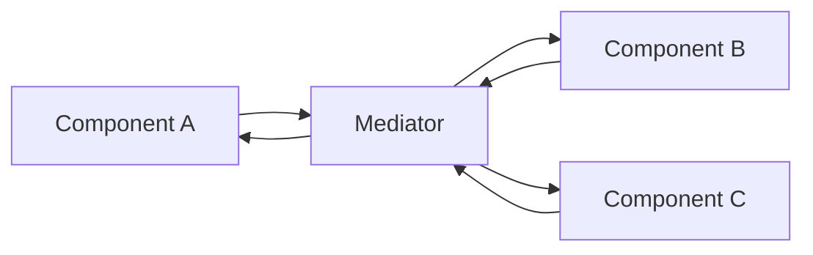

# Mediator

> **Wall Note / A4**
>
> **Intent:** move many-to-many coordination into a dedicated interaction policy. **Risk:** replacing distributed coupling with one god mediator.

## Detailed Notes

Mediator is useful when peers know too much about one another and interaction rules themselves deserve a home.

### Example — UI coordination
A checkout page has address, delivery, coupon, and payment components. Instead of each component calling every other component, a mediator/facade-like coordinator can react to one component and update relevant state.

### Backend example
A workflow coordinator may mediate several application collaborators, but it should own **coordination**, not every participant's business rules.

### Mediator vs Facade
Facade is usually called by a client to simplify a subsystem. Mediator coordinates communication **between colleagues**. The same implementation can resemble both; intent decides the pattern.

### Mediator vs event bus
An event bus gives looser publisher/subscriber coupling and often less explicit flow. Mediator is preferable when orchestration/order/outcomes should be visible. An event bus is preferable when independent reactions are genuinely independent.

### Failure modes
- giant `switch(messageType)`;
- all domain logic migrates to mediator;
- participants still call one another directly, so coupling remains;
- mediator becomes a service locator;
- asynchronous mediator introduced without delivery/failure semantics.

## Senior Questions / Exercises
1. Refactor five mutually coupled UI components.
2. When is direct collaboration clearer than Mediator?
3. Compare Mediator, Facade, and Observer for checkout coordination.
4. How do you keep a workflow mediator from becoming a god service?

## Related Topics
- [Facade](../02-structural/facade.md)
- [Observer](./observer.md)
- [Service Layer](../04-enterprise/service-layer.md)
