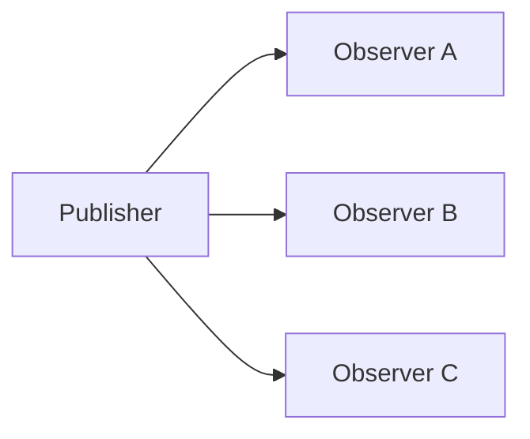

# Observer

> **Wall Note / A4**
>
> **Intent:** notify dependents when state/events change. **Signal:** one-to-many reaction without direct coupling. **Trade-off:** temporal coupling and hidden control flow.



## Detailed Notes

### What and why
Observer decouples the publisher from concrete subscribers, but it moves complexity into timing, delivery, lifecycle, error propagation, and ordering.

A senior design distinguishes:
- a callback/listener;
- an in-process application event;
- a reactive stream;
- a durable integration event.

They may look similar but have very different guarantees.

### How it works
A subject or event source publishes changes; subscribers register or are wired through a framework. Define:
- synchronous vs asynchronous notification;
- subscription lifetime;
- ordering;
- failure propagation;
- backpressure;
- replay;
- duplicate handling.

### When to use it
Use for UI events, reactive state, in-process extensibility, model notifications, and application events where loss on process crash is acceptable.

### When NOT to use it
Do not use an in-memory Observer mechanism for a business requirement that says “this event must eventually reach another service even if this process crashes.”

That requires durable messaging/outbox semantics, not merely Observer.

### Spring vs RxJS vs durable messaging

| Mechanism | Typical scope | Durable? | Backpressure/replay | Main concern |
|---|---|---:|---|---|
| Java listener/callback | object/process | no | manual | lifecycle/order |
| Spring application event | process | no by default | limited/manual | sync/async listener behavior |
| RxJS Observable | UI/process | no | rich operators; replay depending on type | subscription lifecycle |
| message broker/stream | cross-process | yes when configured | broker-specific | delivery/idempotency/lag |

### Angular lifecycle example

```ts
@Component({ /* ... */ })
export class SearchComponent {
  private readonly destroyRef = inject(DestroyRef);

  ngOnInit() {
    this.search.valueChanges
      .pipe(
        debounceTime(250),
        distinctUntilChanged(),
        takeUntilDestroyed(this.destroyRef)
      )
      .subscribe(value => this.load(value));
  }
}
```

The important part is not that RxJS “is Observer”; it is managing lifecycle and asynchronous composition safely.

### Trade-offs
Observer improves extensibility and reduces direct coupling. It can create event cascades, reentrancy, memory leaks, nondeterministic ordering, and difficult debugging.

### Failure modes and common mistakes
- Never unsubscribing from long-lived observables/listeners.
- Assuming subscriber order without a contract.
- Long synchronous work inside a publisher call.
- Publishing before a database transaction commits.
- Using in-process events where durability is required.
- Event names that describe commands rather than facts.

## Senior Questions / Exercises
1. What delivery guarantees does an in-process Observer not provide?
2. How do backpressure and unsubscribe change the classic pattern?
3. When should an Observer event become a durable integration event?
4. What can go wrong if a Spring event listener sends an email before the transaction commits?
5. Compare BehaviorSubject, ordinary Observable, and durable event stream conceptually.

## Related Topics
- [Angular examples](../07-frameworks/angular.md)
- [Command](./command.md)
- [System design: queues/streams](https://github.com/YosrBennagra/system-design)
