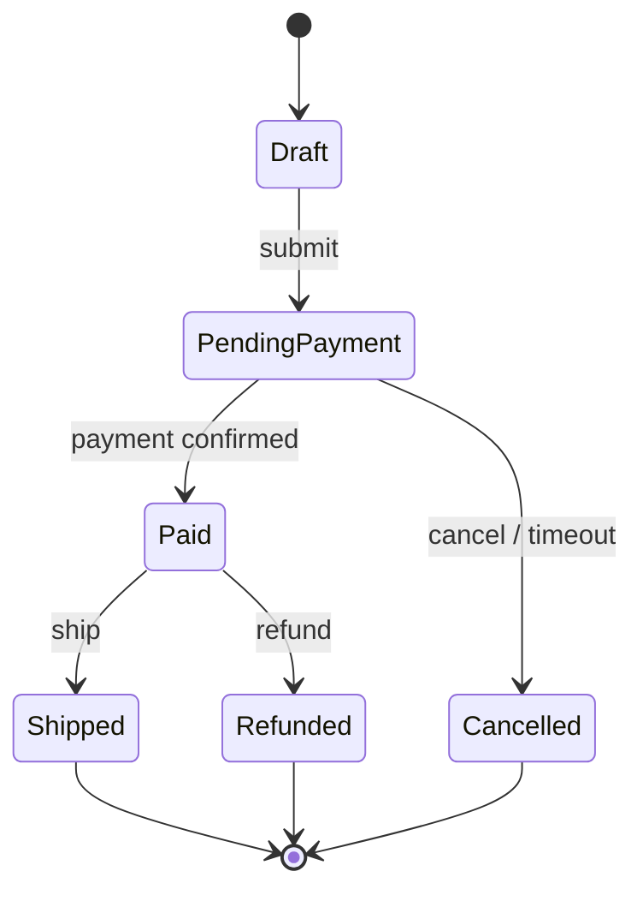

# State

> **Wall Note / A4**
>
> **Intent:** let behavior vary with lifecycle state by making transitions and state-specific operations explicit. **Signal:** repeated state checks and illegal-transition bugs. **Trade-off:** more types and a more distributed transition graph.



## Detailed Notes

### What and why
State turns mode-dependent behavior into explicit lifecycle rules. The strongest reason to use it is not eliminating a switch; it is making valid operations and transitions hard to violate.

### How it works
The context delegates state-sensitive behavior to the current state or transition policy. A transition:
1. checks whether the action is legal;
2. executes state-specific rules;
3. produces the next state;
4. persists the transition atomically with required business changes.

### When to use it
Use for order/payment lifecycles, workflows, protocol connections, document review states, parser modes, and UI modes with meaningful state-dependent behavior.

### When NOT to use it
A small enum plus an explicit switch can be clearer when:
- there are few states;
- behavior is simple;
- transitions rarely change;
- the full transition graph is easier to understand in one place.

For large workflow engines, an explicit transition table or state-machine library can be better than dozens of classes.

### Java example

```java
enum OrderStatus { DRAFT, PENDING_PAYMENT, PAID, CANCELLED }

final class Order {
    private OrderStatus status;

    void markPaid() {
        if (status != OrderStatus.PENDING_PAYMENT) {
            throw new IllegalStateException("Only pending orders can be paid");
        }
        status = OrderStatus.PAID;
    }
}
```

This is intentionally **not** the State pattern. It is often the better starting point.

Move toward State objects only when state-specific behavior grows enough that the enum/switch model becomes difficult to maintain.

### Persistence concern
Object-oriented state and persisted state must agree. If two requests transition the same order concurrently, use version checks, locking, or transactional constraints so both cannot independently succeed.

### Trade-offs
State localizes complex behavior and makes illegal operations explicit. It may make the global workflow harder to see and can create many small classes.

### Failure modes and common mistakes
- Using State solely to remove a three-case switch.
- No concurrency protection on persisted transitions.
- Side effects executed before transition commit without recovery strategy.
- State objects holding mutable business data they do not own.
- Transition graph documented nowhere.

## Senior Questions / Exercises
1. State vs Strategy: what changes and who chooses it?
2. When should you use a state-machine library?
3. How would you persist workflow state safely?
4. How do optimistic locking and idempotency affect state transitions?
5. Take an OrderStatus enum with six states: decide whether State classes are justified.

## Related Topics
- [Strategy](./strategy.md)
- [System design: transactions](https://github.com/YosrBennagra/system-design)
- [Software architecture](https://github.com/YosrBennagra/software-architecture)
