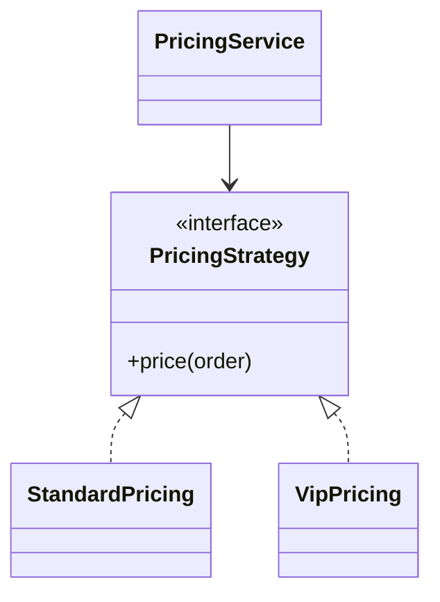

# Strategy

> **Wall Note / A4**
>
> **Intent:** encapsulate interchangeable algorithms/policies. **Signal:** conditional algorithm selection. **Trade-off:** selection logic still exists somewhere.



## Detailed Notes

### What and why
Strategy separates a stable workflow from a varying policy. It is one of the most useful everyday patterns because composition and dependency injection make it lightweight.

The real design question is not “can I create an interface?” It is whether an algorithm/policy changes independently from the caller.

### How it works
Define a narrow policy contract and inject/select an implementation. Put selection in one composition point rather than spreading provider/type checks across callers.

### When to use it
Use for pricing, routing, validation, serialization, provider choice, discount rules, sorting, fraud policies, and retry policy configuration.

### When NOT to use it
Avoid it when:
- variants are one-line functions;
- the algorithm is unlikely to vary;
- a map/table lookup is clearer;
- the behavior changes because of lifecycle state rather than external policy choice.

### Java / Spring example

```java
public interface ShippingStrategy {
    ShippingQuote quote(Shipment shipment);
}

@Component("standard")
final class StandardShipping implements ShippingStrategy {
    public ShippingQuote quote(Shipment shipment) {
        return ShippingQuote.of(/* ... */);
    }
}

@Component("express")
final class ExpressShipping implements ShippingStrategy {
    public ShippingQuote quote(Shipment shipment) {
        return ShippingQuote.of(/* ... */);
    }
}

@Service
final class ShippingService {
    private final Map<String, ShippingStrategy> strategies;

    ShippingService(Map<String, ShippingStrategy> strategies) {
        this.strategies = Map.copyOf(strategies);
    }

    ShippingQuote quote(String mode, Shipment shipment) {
        var strategy = strategies.get(mode);
        if (strategy == null) {
            throw new IllegalArgumentException("Unsupported mode: " + mode);
        }
        return strategy.quote(shipment);
    }
}
```

Selection is centralized; the rest of the workflow stays stable.

### Strategy vs simpler alternatives

| Situation | Prefer |
|---|---|
| two tiny stateless calculations | functions/lambdas |
| static key → value/handler mapping | map/table |
| algorithm family with independent evolution/testing | Strategy |
| behavior changes as object transitions state | State |
| provider API itself is incompatible | Adapter, often combined with Strategy |
| object creation varies | Factory/DI composition |

### Trade-offs
Strategy improves testability and isolates change. The cost is more types, explicit selection, and the possibility of turning every small conditional into a framework.

### Failure modes and common mistakes
- One giant strategy interface used by unrelated policies.
- String-based selection repeated in multiple callers.
- Strategies reaching back into the service to control orchestration.
- Treating Strategy as a substitute for domain modeling.
- Creating ten classes where three lambdas would be clearer.

## Senior Questions / Exercises
1. Strategy vs State: same shape, different intent—explain.
2. How would you register strategies in Spring without a giant switch?
3. When is a lambda enough?
4. How would you combine Adapter and Strategy for multiple providers?
5. Refactor a switch with five branches, then argue whether Strategy actually improved the design.

## Related Topics
- [Factory Method](../01-creational/factory-method.md)
- [Adapter](../02-structural/adapter.md)
- [State](./state.md)
