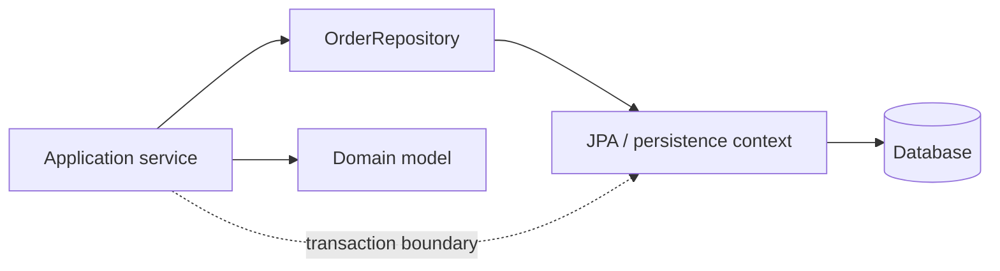
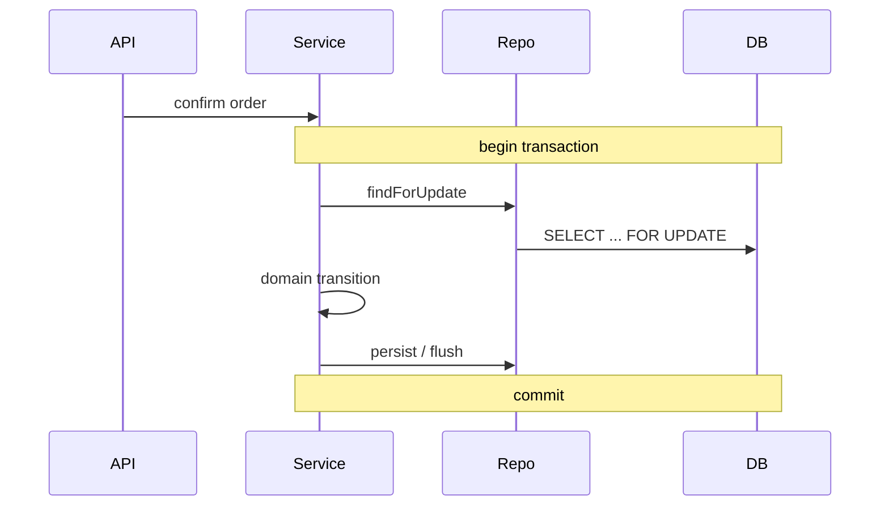

# Repository & Unit of Work

> **Wall Note / A4**
>
> **Repository:** domain-facing boundary for aggregate persistence. **Unit of Work:** coordinates a business transaction's changes. **Do not:** create generic CRUD wrappers that hide database/query reality.



## Detailed Notes

### What and why
Repository protects application/domain code from persistence details where that separation provides value. Unit of Work coordinates changes so an application use case commits or rolls back atomically.

With JPA/Hibernate, the persistence context already behaves like a Unit of Work: it tracks managed entity changes and flushes them within the transaction.

### How it works
Model repository operations around domain needs, not database tables.

Good:
- findById
- findOpenOrdersForCustomer
- findForUpdate
- save aggregate

Suspicious:
- one universal GenericRepository with dozens of generic filter/sort/include arguments.

### Spring example

```java
public interface OrderRepository extends JpaRepository<OrderEntity, UUID> {

    @Lock(LockModeType.PESSIMISTIC_WRITE)
    @Query("select o from OrderEntity o where o.id = :id")
    Optional<OrderEntity> findForUpdate(UUID id);
}

@Service
final class ConfirmOrderService {
    private final OrderRepository orders;

    ConfirmOrderService(OrderRepository orders) {
        this.orders = orders;
    }

    @Transactional
    public void confirm(UUID id) {
        var order = orders.findForUpdate(id).orElseThrow();
        order.confirm();
        // managed entity is flushed by the persistence context
    }
}
```

The repository expresses an important persistence semantic: **locking**. Hiding that behind a generic “getById” would remove useful information.

### Transaction boundary rule
Place the transaction around the application operation that must be atomic, not around every repository/helper call.



### When to use it
Use a repository abstraction when domain/application code benefits from:
- aggregate-oriented operations;
- persistence replacement/isolation;
- query semantics with meaningful names;
- test seams that do not erase important DB behavior.

### When NOT to use it
Avoid:
- wrappers that simply delegate every Spring Data method;
- repositories for pure stateless computations;
- pretending a query is cheap because it looks like an in-memory collection operation.

### Trade-offs
Repository boundaries improve cohesion and protect the domain. Over-abstraction can hide query cost, locking, batching, pagination, transaction, and consistency behavior that callers need to understand.

### Failure modes and common mistakes
- N+1 queries hidden behind repository methods.
- Generic CRUD repository copied across every entity.
- Returning persistence entities directly from external APIs.
- Wide transactions that include remote calls.
- Tests that mock the repository and therefore never test real locking/query behavior.
- Calling save after every tiny entity mutation despite the persistence context already tracking changes.

## Senior Questions / Exercises
1. When is Spring Data already the repository?
2. How can a repository hide harmful performance costs?
3. Where should transaction boundaries live?
4. Why is mocking every repository call insufficient for concurrency-sensitive code?
5. Should an external HTTP call occur inside a database transaction? Explain the exceptions and risks.

## Related Topics
- [System design: transactions](https://github.com/YosrBennagra/system-design)
- [Service Layer](./service-layer.md)
- [Software architecture](https://github.com/YosrBennagra/software-architecture)
