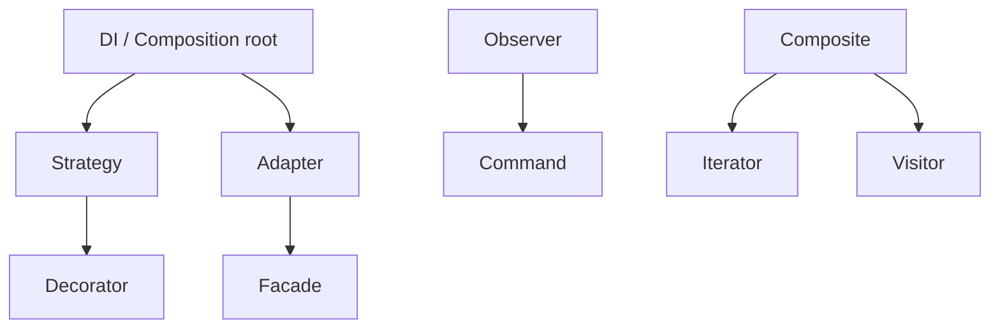

# Pattern Relationships & Combinations

> **Wall Note / A4**
>
> Patterns are vocabulary, not isolated boxes. Combine only when each solves a distinct force.

## Detailed Notes

| Combination | Why it appears |
|---|---|
| Abstract Factory + Factory Method | family factory methods create individual products |
| Builder + Factory | factory chooses a builder/configuration; builder constructs |
| Composite + Iterator | tree representation + traversal |
| Composite + Visitor | stable object tree + many external operations |
| Decorator + Proxy | similar wrappers; different intent can coexist |
| Strategy + Factory/DI | select and assemble interchangeable policy |
| State + Strategy | same delegation shape; different intent |
| Observer + Command | event can trigger an explicit task while preserving fact vs intent |
| Adapter + Facade | translate external interfaces, then simplify subsystem access |

## Senior Questions / Exercises
1. Design a provider integration using Adapter + Strategy + DI and explain why all three are not redundant.
2. Compare Proxy and Decorator for caching.
3. Take a Composite tree and add two operations: when would Visitor be better than node methods?

## Related Topics
- [Pattern selection](../00-foundations/pattern-selection.md)
- [Anti-patterns](../06-antipatterns/README.md)
- [Software architecture](https://github.com/YosrBennagra/software-architecture)
