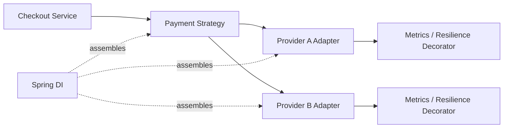

# Combined Pattern Case Studies

> **Wall Note**
>
> Combine patterns only when each one solves a different force. If two patterns solve the same pressure, one is probably redundant.

## Case 1 — Multi-provider payment integration

### Pressures
- provider SDKs have incompatible models;
- provider selection varies by country/currency;
- payment command must survive retries/timeouts;
- metrics/auth/tracing are cross-cutting;
- provider creation/configuration is framework-managed.

### Useful composition



- **Adapter**: translates provider API/types/errors.
- **Strategy**: chooses provider policy.
- **Decorator / interceptor**: adds metrics/resilience mechanics where explicit.
- **DI**: assembles implementations and lifecycle.

Do **not** add Abstract Factory unless a whole family of provider-specific clients must be created coherently.

### Expert checks
- Is payment retry safe?
- Does timeout mean failed or unknown?
- Does decorator order change semantics?
- Is provider selection deterministic/idempotent for retries?
- Can a provider failover cause duplicate charge?

---

## Case 2 — Order workflow

### Pressures
- order lifecycle rules are growing;
- status transitions race under concurrent requests;
- external payment/fulfillment cannot be rolled back atomically.

Possible design:
- **State** only if lifecycle behavior truly outgrows a clear enum model;
- **Command** for externally queued actions;
- **Repository/Unit of Work** for local aggregate transaction;
- **Observer** only for in-process non-durable reactions;
- durable outbox/message mechanisms belong in system design, not classic Observer.

### Trap
State objects do not solve database concurrency. You still need optimistic/pessimistic control, unique constraints, idempotency, or transaction isolation.

---

## Case 3 — Read path with cache, authorization, and metrics

You have:

```text
Controller → DocumentStore
```

Candidate wrappers:

```text
Metrics(Authorization(Cache(DatabaseStore)))
```

Questions:
- Should unauthorized requests touch cache?
- Should metrics include authorization time?
- Is cache result tenant/user scoped?
- Does cache store sensitive data?
- What happens on stale authorization?
- Would framework middleware/AOP make ordering less visible?

Pattern mechanics are easy. **Correct ordering is the design.**

---

## Case 4 — Angular feature boundary

A component currently:
- calls three HTTP services;
- subscribes to route params;
- manipulates browser storage;
- maps vendor SDK models;
- owns retry/loading/error state.

Potential split:
- **Adapter** around vendor/browser APIs;
- feature **Facade** for component-facing use cases;
- RxJS **Observer/reactive** mechanics;
- injected **Strategy** only when policy truly varies.

Do not create one class per pattern. Prefer cohesive feature boundaries.

---

## Case 5 — Reporting subsystem

Requirements:
- multiple report types;
- PDF/HTML/CSV rendering;
- large exports run async;
- output formatting differs from data retrieval.

Potential:
- **Bridge** if report abstraction and rendering both vary independently;
- **Strategy** for sort/calculation policy;
- **Builder** for complex immutable export options;
- **Command** for async export job.

Reject Bridge if one axis is static.

## Expert Exercises

1. Remove one pattern from each case and explain the consequence.
2. For payment, draw transaction/network boundaries.
3. For document wrappers, determine the correct order and test it.
4. For Angular, identify where a Facade would become a god service.
5. For reporting, choose between Bridge and Strategy and justify with change axes.
