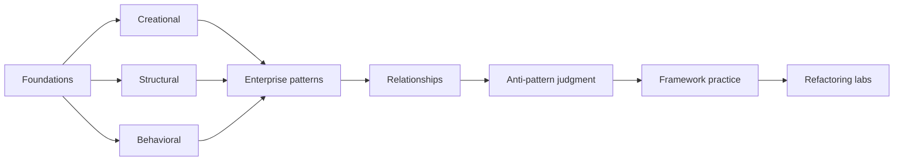

# Design Patterns — 0 → Expert

A practical, senior-oriented design-pattern knowledge base for learning, daily revision, interviews, refactoring practice, and long-term reference.

This repository focuses on **object/design patterns and application-level patterns**. Architecture styles such as microservices, event-driven architecture, DDD strategic design, and distributed-system topology belong in [software-architecture](https://github.com/YosrBennagra/software-architecture).

## Learning order

1. [Foundations](./00-foundations/README.md)
2. [Creational](./01-creational/README.md)
3. [Structural](./02-structural/README.md)
4. [Behavioral](./03-behavioral/README.md)
5. [Enterprise/application patterns](./04-enterprise/README.md)
6. [Relationships & combinations](./05-relationships/pattern-combinations.md)
7. [Smells, anti-patterns & overengineering](./06-antipatterns/README.md)
8. [Java/Spring](./07-frameworks/java-spring.md) and [Angular](./07-frameworks/angular.md)
9. [Practice & refactoring labs](./08-practice/README.md)

## Progress checklist

- [ ] Foundations: intent, forces, trade-offs, refactoring-first mindset
- [ ] 5 creational patterns
- [ ] 7 structural patterns
- [ ] 10 behavioral patterns
- [ ] Enterprise/application patterns
- [ ] Pattern combinations and relationships
- [ ] Anti-patterns and overengineering
- [ ] Java/Spring mappings
- [ ] Angular mappings
- [ ] Complete pattern-comparison drills without notes
- [ ] Complete refactoring labs without naming a pattern first
- [ ] Explain rejected alternatives for each refactoring
- [ ] Identify framework-provided pattern mechanics before hand-writing them

## Topic map

| Area | Topics |
|---|---|
| Creational | Factory Method, Abstract Factory, Builder, Prototype, Singleton |
| Structural | Adapter, Bridge, Composite, Decorator, Facade, Flyweight, Proxy |
| Behavioral | Chain of Responsibility, Command, Iterator, Mediator, Memento, Observer, State, Strategy, Template Method, Visitor |
| Enterprise | Dependency Injection, Repository/Unit of Work, Specification, Service Layer, DTO/Mapper |
| Judgment | code smells, trade-offs, anti-patterns, pattern combinations |
| Framework practice | Spring IoC/AOP/proxies/templates; Angular DI/RxJS/interceptors |
| Practice | refactoring labs, pattern comparisons, framework decisions |

## Knowledge-system links

- **Master index:** [software-engineer-roadmap](https://github.com/YosrBennagra/software-engineer-roadmap)
- **Prerequisites:** [computer-science-fundamentals](https://github.com/YosrBennagra/computer-science-fundamentals) and [programming-principles](https://github.com/YosrBennagra/programming-principles)
- **Architecture boundary:** [software-architecture](https://github.com/YosrBennagra/software-architecture)
- **Scale/distributed trade-offs:** [system-design](https://github.com/YosrBennagra/system-design)

## How to study

Every important topic follows:
1. **Wall Note / A4**
2. **Detailed Notes**
3. **Senior Questions / Exercises**
4. **Related Topics**

Do not start a refactoring by saying “I need Strategy/Factory/etc.” Start with **problem → forces → simplest refactor → pattern only if it earns its complexity**.

A strong senior answer is usually: **problem/forces → stable vs varying axis → simplest option → candidate pattern → rejected alternatives → framework implications → failure modes → tests**.
